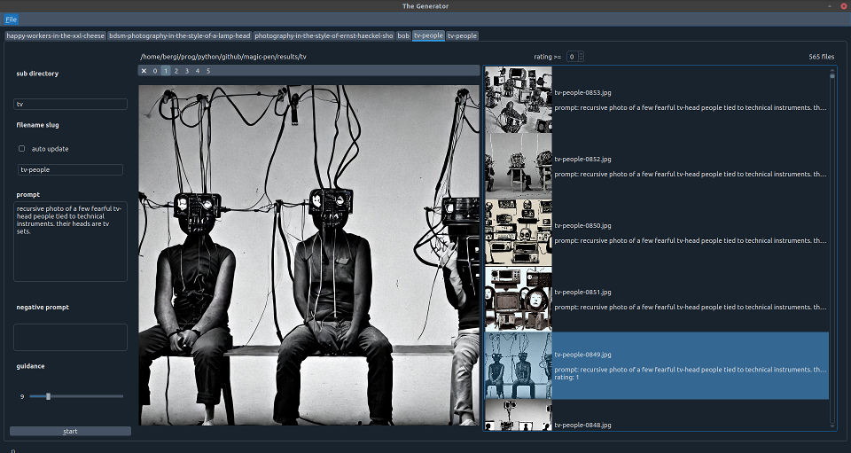

This is supposed to become a painting app utilizing all the trippy neural image generation techniques.
but i`m quite lacking time and GPU memory.

But here's a hack to run the stable-diffusion space on huggingface.co in a Qt application and
save all images to a `./results/` folder:

```shell
pip install -r requirements.txt

python bin/qgenerator.py
```



- `sub directory`: is the path below `./results/` and can be empty
- `filename slug`: is the beginning of the filename and will be appended with increasing numbers
- `prompt`, `negative prompt` and `guidance` do the usual thing

You can create multiple tabs (`Ctrl+T`) for different prompts 
and request processing of the prompts multiple times at once. All jobs run in parallel ;-)

It's possible to quickly delete (`D`) or rate images (`0` to `5`) and filter the list for specific ratings.

The `prompt` and the rating is stored in separate `json` files along with each image.
